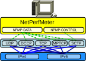

<h1 align="center">
 NetPerfMeter 
 A TCP/MPTCP/UDP/SCTP/DCCP Network Performance Meter Tool 
 <a href="https://www.nntb.no/~dreibh/netperfmeter/">
   
  https://www.nntb.no/~dreibh/netperfmeter
 </a>
</h1>

# 💡 What is Network Performance Meter&nbsp;(NetPerfMeter)?

NetPerfMeter is a network performance meter for the [TCP](https://en.wikipedia.org/wiki/Transmission_Control_Protocol), [MPTCP](https://en.wikipedia.org/wiki/MPTCP), [SCTP](https://en.wikipedia.org/wiki/Stream_Control_Transmission_Protocol), [UDP](https://en.wikipedia.org/wiki/User_Datagram_Protocol), and [DCCP](https://en.wikipedia.org/wiki/DCCP) transport protocols over [IPv4](https://en.wikipedia.org/wiki/IPv4) and [IPv6](https://en.wikipedia.org/wiki/Ipv6). It simultaneously transmits bidirectional flows to an endpoint and measures the resulting flow bandwidths and QoS. Flows can be saturated (i.e.&nbsp;"send as much as possible") or non-saturated with frame rate and frame sizes (like a multimedia transmission). Non-saturated flows can be configured with constant or variable frame rate/frame size, i.e.&nbsp;to realise [Constant Bit Rate&nbsp;(CBR)](https://en.wikipedia.org/wiki/Constant_bitrate) or [Variable Bit Rate&nbsp;(VBR)](https://en.wikipedia.org/wiki/Variable_bitrate) traffic. For both, frame rate and frame size, it is not only possible to set constant values but to also to use random distributions. Furthermore, flows can be set up as on/off flows. Of course, the flow parameters can be configured individually per flow and flow direction.
The measurement results can be recorded as scalar files (summary of the run) and vector files (time series). These files can be processed further, e.g.&nbsp;for detailed analysis and plotting of the results.
The [Wireshark](https://www.wireshark.org/) network protocol analyser provides out-of-the-box support for analysing NetPerfMeter packet traffic.

  
 A NetPerfMeter Run with an SCTP Flow

## Design Goals and Features

The key goal of NetPerfMeter is to provide a tool for the performance comparison of multiple transport connections, which are further denoted as *Flows*. That is, it is possible to configure different flows between two systems using varying parameters, in order run a configured measurement, collect the obtained results and post-process them for statistical analyses. Particularly, all five relevant IETF Transport Layer protocols are supported:

   * [UDP](https://en.wikipedia.org/wiki/User_Datagram_Protocol) (User Datagram Protocol; see [RFC&nbsp;768](https://www.rfc-editor.org/rfc/rfc768.html)),
   * [DCCP](https://en.wikipedia.org/wiki/DCCP) (Datagram Congestion Control Protocol; see [RFC&nbsp;4340](https://www.rfc-editor.org/rfc/rfc4340.html)),
   * [TCP](https://en.wikipedia.org/wiki/Transmission_Control_Protocol) (Transmission Control Protocol; see [RFC&nbsp;793](https://www.rfc-editor.org/rfc/rfc793.html)),
   * [MPTCP](https://en.wikipedia.org/wiki/MPTCP) (Multipath TCP; see [RFC&nbsp;8684](https://www.rfc-editor.org/rfc/rfc8684.html)),
   * [SCTP](https://en.wikipedia.org/wiki/Stream_Control_Transmission_Protocol) (Stream Control Transmission Protocol; see [RFC&nbsp;9260](https://www.rfc-editor.org/rfc/rfc9260.html)).

Of course, this support includes the possibility to parametrise various protocol-specific options. Note, that the protocol support by NetPerfMeter depends on the underlying operating system. DCCP, MPTCP, as well as some SCTP extensions are not available on all platforms, yet.

Furthermore, each flow is able to apply its specific traffic behaviour:

   * Each flow may use its own Transport Layer protocol (i.e.&nbsp;UDP, DCCP, TCP, MTCP or SCTP).
   * Bidirectional data transfer is possible, with individual parameters for each direction.
   * Flows may either be saturated (i.e.&nbsp;try to send as much as possible) or non-saturated. In the latter case, a frame rate and a frame size have to be configured. Both may be distributed randomly, using a certain distribution (like uniform, negative exponential, etc.). This feature allows to mimic multimedia traffic.
   * For the stream-oriented SCTP, an independent traffic configuration is possible for each stream.
   * Support for on-off traffic is provided by allowing to specify a sequence of time stamps when to start, stop and restart a flow or stream.
   * Also, for SCTP, it is possible to configure partial reliability (see [RFC&nbsp;3758](https://www.rfc-editor.org/rfc/rfc3758.html)) as well as ordered and unordered delivery (see [RFC&nbsp;9260](https://www.rfc-editor.org/rfc/rfc9260.html)).

Clearly, the NetPerfMeter application provides features similar to the [NetPerfMeter simulation model in OMNeT++](https://doc.omnetpp.org/inet/api-4.4.0/neddoc/inet.applications.netperfmeter.NetPerfMeter.html). It is therefore relatively easy – from the parametrisation perspective – to reproduce NetPerfMeter simulation scenarios in reality.

## Instances and Protocols

  
 The Concept of a NetPerfMeter Measurement

Similar to the [NetPerfMeter simulation model in OMNeT++](https://doc.omnetpp.org/inet/api-4.4.0/neddoc/inet.applications.netperfmeter.NetPerfMeter.html), an application instance may either be in *Active Mode* (client side) or *Passive Mode* (server side). The figure above illustrates the concept of a NetPerfMeter measurement. The passive instance accepts incoming NetPerfMeter connections from the active instance. The active instance controls the passive instance, by using a control protocol denoted as NetPerfMeter Control Protocol&nbsp;(NPMP-CONTROL). That is, the passive instance may run as a daemon; no manual interaction by the user – e.g.&nbsp;to restart it before a new measurement run – is required. This feature is highly practical for a setup distributed over multiple Internet sites (e.g.&nbsp;like the [NorNet Testbed](https://www.nntb.no/)) and allows for parameter studies consisting of many measurement runs.

The payload data between active and passive instances is transported using the NetPerfMeter Data Protocol&nbsp;(NPMP-DATA). The figure below shows the protocol stack of a NetPerfMeter node.

  
 The NetPerfMeter Protocol Stack

The NPMP-DATA protocol transmits data as frames, with a given frame rate. In case of a saturated sender, the flow tries to send as many frames as possible (i.e.&nbsp;as allowed by the underlying transport and its flow and congestion control). Otherwise, the configured frame rate is used (e.g.&nbsp;25 frames/s as for typical video transmissions). NPMP-DATA breaks down frames into messages, to make sure that large frames can be transported over the underlying transport protocol. The maximum message size can be configured. Frames larger than the message size limit are split into multiple messages before sending them. On the receiving side, the messages are combined back into frames. The underlying transport protocol handles the messages as its payload.

## Measurement Processing

The following figure presents the message sequence of a NetPerfMeter measurement run:

  
 A Measurement Run with NetPerfMeter

Note that the [Wireshark](https://www.wireshark.org/) network protocol analyser provides out-of-the-box support for NetPerfMeter. That is, it is able to dissect and further analyse NPMP-CONTROL and NPMP-DATA packets using all supported Transport Layer protocols.

## Measurement Setup

A new measurement run setup is initiated by the active NetPerfMeter instance by establishing an NPMP-CONTROL association to the passive instance first. The NPMP-CONTROL association by default uses SCTP for transport. If SCTP is not possible in the underlying networks (e.g.&nbsp;due to firewalling restrictions), it is optionally possible to use TCP for the NPMP-CONTROL association instead. Then, the configured NPMP-DATA connections are established by their configured Transport Layer protocols. For the connection-less UDP, the message transfer is just started. The passive NetPerfMeter instance is informed about the identification and parameters of each new flow by using NPMP-CONTROL&nbsp;Add&nbsp;Flow messages. On startup of the NPMP-DATA flow, an NPMP-DATA&nbsp;Identify message allows the mapping of a newly incoming connection to a configured flow by the passive instance. It acknowledges each newly set up flow by an NPMP-CONTROL&nbsp;Acknowledge message. After setting up all flows, the scenario is ready to start the measurement run.

## Measurement Run

The actual measurement run is initiated from the active NetPerfMeter instance using an NPMP-CONTROL&nbsp;Start&nbsp;Measurement message, which is also acknowledged by an NPMP-CONTROL&nbsp;Acknowledge message. Then, both instances start running the configured scenario by transmitting NPMP-DATA&nbsp;Data messages over their configured flows.

During the measurement run, incoming and outgoing flow bandwidths may be recorded as vectors – i.e.&nbsp;time series – at both instances, since NPMP-DATA&nbsp;Data traffic may be bidirectional. Furthermore, the CPU utilisations – separately for each CPU and CPU&nbsp;core – are also tracked. This allows to identify performance bottlenecks, which is particularly useful when debugging and comparing transport protocol implementation performance. Furthermore, the one-way delay of messages can be recorded. Of course, in order to use this feature, the clocks of both nodes need to be appropriately synchronised, e.g.&nbsp;by using the [Network Time Protocol&nbsp;(NTP)](https://en.wikipedia.org/wiki/Network_Time_Protocol).

## Measurement Termination

The end of a measurement run is initiated – from the active NetPerfMeter instance – by using an NPMP-CONTROL&nbsp;Stop&nbsp;Measurement message. Again, it is acknowledged by an NPMP-CONTROL&nbsp;Acknowledge message. At the end of the measurement, average bandwidth and one-way delay of each flow and stream are recorded as scalars (i.e.&nbsp;single values). They may provide an overview of the long-term system performance.

## Result Collection

After stopping the measurement, the passive NetPerfMeter instance sends its global vector and scalar results (i.e.&nbsp;over all flows) to the active instance, by using one or more NPMP-CONTROL&nbsp;Results messages.
Then, the active NetPerfMeter instance sequentially removes the flows by using NPMP-CONTROL&nbsp;Remove&nbsp;Flow messages, which are acknowledged by NPMP-CONTROL Acknowledge messages. On flow removal, the passive instance sends its per-flow results for the corresponding flow, again by using NPMP-CONTROL&nbsp;Results messages.

The active instance, as well, archives its local vector and scalar results data and stores them – together with the results received from its peer – locally.
All result data is compressed by using BZip2 compression (see [bzip2](https://sourceware.org/bzip2/)), which may save a significant amount of bandwidth (of course, the passive node compresses the data *before* transfer) and disk space.

## Measurement Execution, Result Post-Processing and Visualisation

By using shell scripts, it is possible to apply NetPerfMeter for parameter studies, i.e.&nbsp;to create a set of runs for each input parameter combination. For example, a script could iterate over a send buffer size&nbsp;σ from&nbsp;64&nbsp;KiB to 192&nbsp;KiB in steps of 64&nbsp;KiB as well as a path bandwidth&nbsp;ρ from&nbsp;10&nbsp;Mbit/s to 100&nbsp;Mbit/s in steps of&nbsp;10&nbsp;Mbit/s and perform 5&nbsp;measurement runs for each parameter combination.

When all measurement runs have eventually been processed, the results have to be visualised for analysis and interpretation. The NetPerfMeter package provides support to visualise the scalar results, which are distributed over the scalar files written by measurement runs. Therefore, the first step necessary is to bring the data from the various scalar files into an appropriate form for further post-processing. This step is denoted as *Summarisation*; an introduction is also provided in "[SimProcTC – The Design and Realization of a Powerful Tool-Chain for OMNeT++ Simulations](https://www.nntb.no/~dreibh/netperfmeter/#Publications-OMNeT__Workshop2009)".

The summarisation task is performed by the tool <tt>createsummary</tt>. An external program – instead of just using [GNU&nbsp;R](https://www.r-project.org/) itself to perform this step – is used due to the requirements on memory and CPU power. <tt>createsummary</tt> iterates over all scalar files of a measurement&nbsp;M. Each file is read – with on-the-fly BZip2-decompression – and each scalar value as well as the configuration&nbsp;m∈M having led to this value – are stored in memory. Depending on the number of scalars, the required storage space may have a size of multiple&nbsp;GiB.

Since usually not all scalars of a measurement are required for analysis (e.g.&nbsp;for an SCTP measurement, it may be unnecessary to include unrelated statistics), a list of scalar name prefixes to be excluded from summarisation can be provided to <tt>createsummary</tt>, in form of the so-called *Summary Skip List*. This feature may significantly reduce the memory and disk space requirements of the summarisation step. Since the skipped scalars still remain stored in the scalar files themselves, it is possible to simply re-run <tt>createsummary</tt> with updated summary skip list later, in order to also include them.

Having all relevant scalars stored in memory, a data file – which can be processed by [GNU&nbsp;R](https://www.r-project.org/), [LibreOffice](https://www.libreoffice.org/) or other programs – is written for each scalar. The data file is simply a table in text form, containing the column names on the first line. Each following line contains the data, with line number and an entry for each column (all separated by spaces); an example is provided in Listing&nbsp;3 of "[SimProcTC – The Design and Realization of a Powerful Tool-Chain for OMNeT++ Simulations](https://www.nntb.no/~dreibh/netperfmeter/#Publications-OMNeT__Workshop2009)". That is, each line consists of the settings of all parameters and the resulting scalar value. The data files are also BZip2-compressed on the fly, in order to reduce the storage space requirements.

# 😀 Examples

## Preparations

NetPerfMeter uses the SCTP protocol. It may be necessary to allow loading the SCTP kernel module first, if not already enabled. The following code blocks show how to enable it permanently.

### SCTP on Linux

<pre>
echo "sctp" | sudo tee /etc/modules-load.d/sctp.conf
if [ -e /etc/modprobe.d/sctp-blacklist.conf ] ; then
   sudo sed -e 's/^blacklist sctp/# blacklist sctp/g' -i /etc/modprobe.d/sctp-blacklist.conf
fi
sudo modprobe sctp
lsmod | grep sctp
</pre>

### SCTP on FreeBSD

<pre>
echo 'sctp_load="YES"' | sudo tee --append /boot/loader.conf
sudo kldload sctp
kldstat | grep sctp
</pre>

## Starting the Passive Instance (Server)

* Run a passive instance (i.e.&nbsp;server side), using port 9000:

  <pre>
  user@server:~$ netperfmeter 9000
  </pre>

  ⚠️Important: By default, SCTP transport is used for the NPMP-CONTROL control communication. In certain setups, this can cause problems. In this case, it may be necessary to use control over TCP (or MPTCP) instead (to be shown in the next example):

  - Firewalls blocking SCTP traffic, e.g&nbsp;many public Wi-Fi networks.
  - Routing over NAT/PAT may not work well due to lack of support for SCTP.
  - The Docker daemon, by default, creates a local interface <em>dummy0</em> with IP address&nbsp;172.17.0.1 for the default [bridge network setup](https://docs.docker.com/engine/network/drivers/bridge/). If this is enabled on active and passive side, the SCTP out-of-the blue&nbsp;(OOTB) message handling causes the SCTP association to be aborted, since both devices have an identical IP&nbsp;address.

* Run a passive instance (i.e.&nbsp;server side), using port 9000, and allowing NPMP-CONTROL control communication over TCP support:

  <pre>
  user@server:~$ netperfmeter 9000 -control-over-tcp
  </pre>

## Running the Active Instance (Client)

## Simple TCP Communication

* Run an active instance (i.e.&nbsp;client side), with a saturated bidirectional TCP flow:

  <pre>
  user@client:~$ netperfmeter <em>&lt;SERVER&gt;</em>:9000 -tcp const0:const1400:const0:const1400
  </pre>

  Replace <em>&lt;SERVER&gt;</em> by the IP&nbsp;address or hostname of the passive instance!

  The flow parameter specifies a saturated flow (frame rate&nbsp;0 – send a much as possible) with a constant frame size of 1400&nbsp;B. The first block specifies the direction from active (client) to passive (server) instance, the second block specifies the direction from passive (server) to active (client) instance.

  ⚠️Important: By default, SCTP transport is used for the NPMP-CONTROL control communication. In certain setups, this can cause problems. In this case, it may be necessary to use control over TCP (or MPTCP) instead (to be shown in the next example):

  - Firewalls blocking SCTP traffic, e.g&nbsp;many public Wi-Fi networks.
  - Routing over NAT/PAT may not work well due to lack of support for SCTP.
  - The Docker daemon, by default, creates a local interface <em>dummy0</em> with IP address&nbsp;172.17.0.1 for the default [bridge network setup](https://docs.docker.com/engine/network/drivers/bridge/). If this is enabled on active and passive side, the SCTP out-of-the blue&nbsp;(OOTB) message handling causes the SCTP association to be aborted, since both devices have an identical IP&nbsp;address.

* Run an active instance (i.e.&nbsp;client side), with a saturated bidirectional TCP flow, using NPMP-CONTROL control communication over TCP.

  <pre>
  user@client:~$ netperfmeter <em>&lt;SERVER&gt;</em>:9000 -control-over-tcp -tcp const0:const1400:const0:const1400
  </pre>

  Note: The passive instance must be started with <tt>-control-over-tcp</tt> as well!

* Run an active instance (i.e.&nbsp;client side), with a saturated bidirectional TCP flow, using NPMP-CONTROL control communication over SCTP (this is the default):

  <pre>
  user@client:~$ netperfmeter <em>&lt;SERVER&gt;</em>:9000 -tcp const0:const1400:const0:const1400
  </pre>

* Run an active instance (i.e.&nbsp;client side), with a download-only TCP flow (server to client):

  <pre>
  user@client:~$ netperfmeter <em>&lt;SERVER&gt;</em>:9000 -tcp const0:const0:const0:const1400
  </pre>
  Setting both, frame rate and frame size to 0, means to send nothing in the corresponding direction.

* Run an active instance (i.e.&nbsp;client side), with a upload-only TCP flow (client to server):

  <pre>
  user@client:~$ netperfmeter <em>&lt;SERVER&gt;</em>:9000 -tcp const0:const1400:const0:const0
  </pre>

## Simple Non-TCP Communication

* Run an active instance (i.e.&nbsp;client side), with bidirectional UDP flow:

  - Active to passive instance: constant 2&nbsp;frames/s, constant 200&nbsp;B/frame;
  - Passive to active instance: constant 25&nbsp;frames/s, constant 5000&nbsp;B/frame.

  <pre>
  user@client:~$ netperfmeter <em>&lt;SERVER&gt;</em>:9000 -udp const2:const200:const25:const5000
  </pre>

  Setting both, frame rate and frame size to constant 0, which means to send nothing in the corresponding direction.

  Note: UDP does not have flow and congestion control. A saturated UDP flow is therefore <em>not</em> possible!

* Run an active instance (i.e.&nbsp;client side), with bidirectional DCCP flow:

  - Active to passive instance: constant 10&nbsp;frames/s, constant 128&nbsp;B/frame;
  - Passive to active instance: constant 25&nbsp;frames/s, constant 1200&nbsp;B/frame.

  <pre>
  user@client:~$ netperfmeter <em>&lt;SERVER&gt;</em>:9000 -dccp const10:const128:const25:const1200
  </pre>
  Note: DCCP is only available when provided by the operating system kernel!

* Run an active instance (i.e.&nbsp;client side), with 2&nbsp;bidirectional SCTP flows over a single SCTP association (i.e.&nbsp;2&nbsp;streams):

  Stream 0:

  - Active to passive instance: constant 2&nbsp;frames/s, constant 200&nbsp;B/frame;
  - Passive to active instance: constant 25&nbsp;frames/s, constant 5000&nbsp;B/frame.

  Stream 1:

  - Active to passive instance: constant 10&nbsp;frames/s, constant 128&nbsp;B/frame;
  - Passive to active instance: constant 25&nbsp;frames/s, constant 1200&nbsp;B/frame.

  <pre>
  user@client:~$ netperfmeter <em>&lt;SERVER&gt;</em>:9000 -sctp const2:const200:const25:const5000 const10:const128:const25:const1200
  </pre>

* Run an active instance (i.e.&nbsp;client side), with a saturated bidirectional MPTCP flow:

  <pre>
  user@client:~$ netperfmeter <em>&lt;SERVER&gt;</em>:9000 -mptcp const0:const1400:const0:const1400
  </pre>

  Notes:

  - MPTCP is only available when provided by the operating system kernel!
  - NetPerfMeter &ge;2.0 is required! Older versions &lt;2.0 only support the expermental Linux MTCP with incompatible API!

## Variable Bitrate Flows

NetPerfMeter supports randomised frame rate and frame size, to create variable bitrate&nbsp;(VBR) flows. The following distributions are currently available:

* <tt>const<em>&lt;value&gt;</em>,<em>&lt;b&gt;</em></tt>: Constant, i.e.&nbsp;always the same setting <em>&lt;value&gt;</em>. Example: a frame rate const1000 means that all frames have a size of 1000&nbsp;bytes.
* <tt>uniform<em>&lt;a&gt;</em>,<em>&lt;b&gt;</em></tt>: Uniform distribution from the interval [a,b). Example: uniform900,1100.
* <tt>exp<em>&lt;p&gt;</em></tt>: Exponential distribution with mean <em>&lt;mean&gt;</em>. Example: exp1000.
* <tt>pareto<em>&lt;location&gt;</em>,<em>&lt;shape&gt;</em></tt>: Pareto distribution with location <em>&lt;location&gt;</em> and shape <em>&lt;shape&gt;</em>. Example: pareto0.166667,1.5.
* <tt>normal<em>&lt;mean&gt;</em>,<em>&lt;stddev&gt;</em></tt>: Normal distribution with mean <em>&lt;mean&gt;</em> and standard deviation <em>&lt;stddev&gt;</em>. Example: normal1000,500.
Note that normal distribution may result in negative values, which may be ignored (frame size) or interpreted as saturated traffic (frame rate). Use truncnormal to prevent negative values.
* <tt>truncnormal<em>&lt;mean&gt;</em>,<em>&lt;stddev&gt;</em></tt>: Truncated normal distribution with mean <em>&lt;mean&gt;</em> and standard deviation <em>&lt;stddev&gt;</em>, i.e. normal distribution without negative values. Example: truncnormal1000,500.

A configured distribution is used to determine:

* The time for generating the next frame (when used for frame rate),
* The size of the next frame (when used for frame size).
* The next flow on/off time (when used for on/off flow configuration).

Some examples:

* A unidirectional TCP flow with constant 2&nbsp;frames;/s and uniformly distributed frame sizes between 100&nbsp;bytes and 20000&nbsp;bytes:
  <pre>
  user@client:~$ netperfmeter <em>&lt;SERVER&gt;</em>:9000 -tcp const2:uniform100,20000
  </pre>

* A bidirectional SCTP flow with constant 2&nbsp;frames;/s and uniformly distributed frame sizes between 100&nbsp;bytes and 1000&nbsp;bytes outgoing, and an uniform frame rate from [0.2, 10.5) frames/s and frame sizes with an average of 1000&nbsp;bytes using exponential distribution incoming:
  <pre>
  user@client:~$ netperfmeter <em>&lt;SERVER&gt;</em>:9000 -sctp const2:uniform100,1000:uniform0.2,10.5:exp1000
  </pre>

* An incoming UDP flow, with constant 25&nbsp;frames/s of constant 1000&nbsp;bytes, on-time and off-time pareto-distributed with location&nbsp;0.166667 and shape&nbsp;1.5, repeating in a loop:
  <pre>
  user@client:~$ netperfmeter <em>&lt;SERVER&gt;</em>:9000 -udp const0:const0:const25:const1000:onoff=+pareto0.166667,1.5,+pareto0.166667,1.5,repeat
  </pre>

## Multiple Flows and Measurement Results Recording

* Run an active instance (i.e.&nbsp;client side), with 7&nbsp;flows, stopping the measurement after 60&nbsp;s:

  - TCP flow, constant 10&nbsp;frames/s, constant 4096&nbsp;B/frame, in both directions;
  - UDP flow, constant 10&nbsp;frames/s, constant 1024&nbsp;B/frame, in both directions;
  - SCTP flows with 5&nbsp;streams, and for each stream constant 1, 2, 3, 4, or 5&nbsp;frames/s, constant 512&nbsp;B/frame, in both directions, but with reversed frame rate order in backwards direction, all over a single SCTP association.

  <pre>
  user@client:~$ netperfmeter <em>&lt;SERVER&gt;</em>:9000 \
     -runtime=60 \
     -tcp  const10:const4096:const10:const4906 \
     -udp  const10:const1024:const10:const1024 \
     -sctp \
        const1:const512:const5:const512 \
        const2:const512:const4:const512 \
        const3:const512:const3:const512 \
        const4:const512:const2:const512 \
        const5:const512:const1:const512
  </pre>

* Run an active instance (i.e.&nbsp;client side), with 9&nbsp;flows, stopping the measurement after 60&nbsp;s:

  - TCP flow, constant 10&nbsp;frames/s, constant 4096&nbsp;B/frame, in both directions;
  - MPTCP flow, constant 10&nbsp;frames/s, constant 4096&nbsp;B/frame, in both directions;
  - UDP flow, constant 10&nbsp;frames/s, constant 1024&nbsp;B/frame, in both directions;
  - DCCP flow, constant 10&nbsp;frames/s, constant 1024&nbsp;B/frame, in both directions;
  - SCTP flows with 5&nbsp;streams, and for each stream constant 1, 2, 3, 4, or 5&nbsp;frames/s, constant 512&nbsp;B/frame, in both directions, but with reversed frame rate order in backwards direction, all over a single SCTP association.

  The example above, but recording measurement data and flow information into files, including descriptions for active/passive instance and the flows:

  - Configuration file: <tt>multi.config</tt>;
  - Vector files: <tt>multi-&lt;active|passive&gt;-&lt;<em>FLOW</em>&gt;-&lt;<em>STREAM</em>&gt;.vec</tt>;
  - Scalar files: <tt>multi-&lt;active|passive&gt;.sca</tt>.

  <pre>
  user@client:~$ netperfmeter <em>&lt;SERVER&gt;</em>:9000 \
    -runtime=60 \
    -config=multi.config \
    -vector=multi.vec \
    -scalar=multi.sca \
    -activenodename "Active Instance" \
    -passivenodename "Passive Instance" \
    -tcp   const10:const4096:const10:const4906:description="TCP" \
    -mptcp const10:const4096:const10:const4906:description="MPTCP" \
    -udp   const10:const1024:const10:const1024:description="UDP" \
    -dccp  const10:const1024:const10:const1024:description="DCCP" \
    -sctp \
        const1:const512:const5:const512:description="SCTP Stream 0" \
        const2:const512:const4:const512:description="SCTP Stream 1" \
        const3:const512:const3:const512:description="SCTP Stream 2" \
        const4:const512:const2:const512:description="SCTP Stream 3" \
        const5:const512:const1:const512:description="SCTP Stream 4"
  </pre>

  Notes:
  - Note: DCCP and MPTCP are only available when provided by the operating system kernel!
  - NetPerfMeter &ge;2.0 is required! Older versions &lt;2.0 only support the expermental Linux MTCP with incompatible API!

* An example output of the multi-flow example above, measurered in a multi-homed testbed setup, provides the following output:

  - The configuration file <tt>[multi.config](https://github.com/dreibh/netperfmeter/blob/master/src/results-examples/multi.config)</tt>. It contains the flows and their parameters. It can be used to further process the scalar and vector output.
  - Scalar files (i.e.&nbsp;summaries of the single measurement run) from active side (<tt>[multi-active.sca](https://github.com/dreibh/netperfmeter/blob/master/src/results-examples/multi-active.sca)</tt>) and passive side (<tt>[multi-passive.sca](https://github.com/dreibh/netperfmeter/blob/master/src/results-examples/multi-passive.sca)</tt>). The scalar file format is the same as used by [OMNeT++](https://omnetpp.org/).
  - Vector files (i.e.&nbsp;time series) for each flow, from active and passive side:

    + Flow 0 (TCP flow):
      <tt>[multi-active-00000000-0000.vec](https://github.com/dreibh/netperfmeter/blob/master/src/results-examples/multi-active-00000000-0000.vec)</tt>,
      <tt>[multi-passive-00000000-0000.vec](https://github.com/dreibh/netperfmeter/blob/master/src/results-examples/multi-passive-00000000-0000.vec)</tt>.

    + Flow 1 (MPTCP flow):
      <tt>[multi-active-00000001-0000.vec](https://github.com/dreibh/netperfmeter/blob/master/src/results-examples/multi-active-00000001-0000.vec)</tt>,
      <tt>[multi-passive-00000001-0000.vec](https://github.com/dreibh/netperfmeter/blob/master/src/results-examples/multi-passive-00000001-0000.vec)</tt>.

    + Flow 2 (UDP flow):
      <tt>[multi-active-00000002-0000.vec](https://github.com/dreibh/netperfmeter/blob/master/src/results-examples/multi-active-00000002-0000.vec)</tt>,
      <tt>[multi-passive-00000002-0000.vec](https://github.com/dreibh/netperfmeter/blob/master/src/results-examples/multi-passive-00000002-0000.vec)</tt>.

    + Flow 3 (DCCP flow):
      <tt>[multi-active-00000003-0000.vec](https://github.com/dreibh/netperfmeter/blob/master/src/results-examples/multi-active-00000003-0000.vec)</tt>,
      <tt>[multi-passive-00000003-0000.vec](https://github.com/dreibh/netperfmeter/blob/master/src/results-examples/multi-passive-00000003-0000.vec)</tt>.

    + Flow 4 (SCTP flow for SCTP stream 0):
      <tt>[multi-active-00000004-0000.vec](https://github.com/dreibh/netperfmeter/blob/master/src/results-examples/multi-active-00000004-0000.vec)</tt>,
      <tt>[multi-passive-00000004-0000.vec](https://github.com/dreibh/netperfmeter/blob/master/src/results-examples/multi-passive-00000004-0000.vec)</tt>.

    + Flow 5 (SCTP flow for SCTP stream 1):
      <tt>[multi-active-00000005-0001.vec](https://github.com/dreibh/netperfmeter/blob/master/src/results-examples/multi-active-00000005-0001.vec)</tt>,
      <tt>[multi-passive-00000005-0001.vec](https://github.com/dreibh/netperfmeter/blob/master/src/results-examples/multi-passive-00000005-0001.vec)</tt>.

    + Flow 6 (SCTP flow for SCTP stream 2):
      <tt>[multi-active-00000006-0002.vec](https://github.com/dreibh/netperfmeter/blob/master/src/results-examples/multi-active-00000006-0002.vec)</tt>,
      <tt>[multi-passive-00000006-0002.vec](https://github.com/dreibh/netperfmeter/blob/master/src/results-examples/multi-passive-00000006-0002.vec)</tt>.

    + Flow 7 (SCTP flow for SCTP stream 3):
      <tt>[multi-active-00000007-0003.vec](https://github.com/dreibh/netperfmeter/blob/master/src/results-examples/multi-active-00000007-0003.vec)</tt>,
      <tt>[multi-passive-00000007-0003.vec](https://github.com/dreibh/netperfmeter/blob/master/src/results-examples/multi-passive-00000007-0003.vec)</tt>.

    + Flow 8 (SCTP flow for SCTP stream 4):
      <tt>[multi-active-00000008-0004.vec](https://github.com/dreibh/netperfmeter/blob/master/src/results-examples/multi-active-00000008-0004.vec)</tt>,
      <tt>[multi-passive-00000008-0004.vec](https://github.com/dreibh/netperfmeter/blob/master/src/results-examples/multi-passive-00000008-0004.vec)</tt>.

   The vector file format is a table, which can be read with CSV import of tools like [GNU&nbsp;R](https://www.r-project.org/), [LibreOffice](https://www.libreoffice.org/), etc.

## Wireshark

* Run T-Shark (the command-line version of the [Wireshark](https://www.wireshark.org/) network protocol analyser) to record a PCAP trace:

  <pre>
  user@client:~$ sudo tshark -i any -n -w output.pcap \
     -f '(sctp port 9001) or ((tcp port 9000) or (tcp port 8999) or (udp port 9000) or (sctp port 9000) or (ip proto 33))'
  </pre>

  Notes:

  - Filter parameters for protocols and ports can ensure to record only the relevant NetPerfMeter traffic.
  - In case of using port&nbsp;9000 for NetPerfMeter, use:

    + SCTP, port 9000 and 9001 (data and control traffic over SCTP);
    + TCP, port 8999, 9000 and 9001 (data and control traffic over TCP and MPTCP);
    + UDP, port 9000;
    + DCCP, port 9000 (<tt>ip proto 33</tt>).

* Run [Wireshark](https://www.wireshark.org/) network protocol analyser to display the packet flow of the <a href="#active-multi">multi-flows example</a> above in PCAP file <tt>[multi.pcap.gz](https://github.com/dreibh/netperfmeter/blob/master/src/results-examples/multi.pcap.gz)</tt>:

  <pre>
  user@client:~$ wireshark multi.pcap.gz
  </pre>

   
   A Wireshark Run with NetPerfMeter Traffic from <tt>[multi.pcap.gz](https://github.com/dreibh/netperfmeter/blob/master/src/results-examples/multi.pcap.gz)</tt>

  Notes:

  - Wireshark provides out-of-the-box support for NetPerfMeter, i.e.&nbsp;a dissector is included in all recent Wireshark packages.
  - Color filtering rules can colorise NetPerfMeter traffic, e.g.&nbsp; to mark different packet types or flows/streams. An example configuration is provided in <tt>[colorfilters](https://github.com/dreibh/netperfmeter/blob/master/src/wireshark/colorfilters)</tt> (needs to be merged into own configuration, usually in <tt>~/.config/wireshark/colorfilters</tt>).

## Miscellaneous

* Take a look into the manual page of NetPerfMeter for further information and options:

  <pre>
  man netperfmeter
  </pre>

* Obtain the NetPerfMeter version:

  <pre>
  netperfmeter -version
  </pre>
  Note: NetPerfMeter &ge;2.0 is required!

# 📦 Binary Package Installation

Please use the issue tracker at [https://github.com/dreibh/netperfmeter/issues](https://github.com/dreibh/netperfmeter/issues) to report bugs and issues!

## Ubuntu Linux

For ready-to-install Ubuntu Linux packages of NetPerfMeter, see [Launchpad PPA for Thomas Dreibholz](https://launchpad.net/~dreibh/+archive/ubuntu/ppa/+packages?field.name_filter=netperfmeter&field.status_filter=published&field.series_filter=)!

<pre>
sudo apt-add-repository -sy ppa:dreibh/ppa
sudo apt-get update
sudo apt-get install netperfmeter
</pre>

## Fedora Linux

For ready-to-install Fedora Linux packages of NetPerfMeter, see [COPR PPA for Thomas Dreibholz](https://copr.fedorainfracloud.org/coprs/dreibh/ppa/package/netperfmeter/)!

<pre>
sudo dnf copr enable -y dreibh/ppa
sudo dnf install netperfmeter
</pre>

## FreeBSD

For ready-to-install FreeBSD packages of NetPerfMeter, it is included in the ports collection, see [FreeBSD ports tree index of benchmarks/netperfmeter/](https://cgit.freebsd.org/ports/tree/benchmarks/netperfmeter/)!

<pre>
pkg install netperfmeter
</pre>

Alternatively, to compile it from the ports sources:

<pre>
cd /usr/ports/benchmarks/netperfmeter
make
make install
</pre>

# 💾 Build from Sources

NetPerfMeter is released under the [GNU General Public Licence&nbsp;(GPL)](https://www.gnu.org/licenses/gpl-3.0.en.html#license-text).

Please use the issue tracker at [https://github.com/dreibh/netperfmeter/issues](https://github.com/dreibh/netperfmeter/issues) to report bugs and issues!

## Development Version

The Git repository of the NetPerfMeter sources can be found at [https://github.com/dreibh/netperfmeter](https://github.com/dreibh/netperfmeter):

<pre>
git clone https://github.com/dreibh/netperfmeter
cd netperfmeter
cmake .
make
</pre>

Contributions:

* Issue tracker: [https://github.com/dreibh/netperfmeter/issues](https://github.com/dreibh/netperfmeter/issues).
  Please submit bug reports, issues, questions, etc. in the issue tracker!

* Pull Requests for NetPerfMeter: [https://github.com/dreibh/netperfmeter/pulls](https://github.com/dreibh/netperfmeter/pulls).
  Your contributions to NetPerfMeter are always welcome!

* CI build tests of NetPerfMeter: [https://github.com/dreibh/netperfmeter/actions](https://github.com/dreibh/netperfmeter/actions).

* Coverity Scan analysis of NetPerfMeter: [https://scan.coverity.com/projects/dreibh-netperfmeter](https://scan.coverity.com/projects/dreibh-netperfmeter).

## Release Versions

See [https://www.nntb.no/~dreibh/netperfmeter/#current-stable-release](https://www.nntb.no/~dreibh/netperfmeter/#current-stable-release) for release packages!

# 🖋️ Citing NetPerfMeter in Publications

NetPerfMeter BibTeX entries can be found in [netperfmeter.bib](https://github.com/dreibh/netperfmeter/blob/master/src/netperfmeter.bib)!

 * [Dreibholz, Thomas](https://www.nntb.no/~dreibh/); [Becke, Martin](https://www.haw-hamburg.de/hochschule/beschaeftigte/detail/person/person/show/martin-becke/); [Adhari, Hakim](https://web.archive.org/web/20240909081216/https://tdr.informatik.uni-due.de/en/team/former-staff/hakim-adhari/) and [Rathgeb, Erwin Paul](https://web.archive.org/web/20241126012608/https://tdr.informatik.uni-due.de/en/team/erwin-p-rathgeb/): «[Evaluation of A New Multipath Congestion Control Scheme using the NetPerfMeter Tool-Chain](https://www.wiwi.uni-due.de/fileadmin/fileupload/I-TDR/SCTP/Paper/SoftCOM2011.pdf)» ([PDF](https://www.wiwi.uni-due.de/fileadmin/fileupload/I-TDR/SCTP/Paper/SoftCOM2011.pdf), 360&nbsp;KiB, 6&nbsp;pages, 🇬🇧), in *Proceedings of the 19th IEEE International Conference on Software, Telecommunications and Computer Networks&nbsp;(SoftCOM)*, pp.&nbsp;1–6, ISBN&nbsp;978-953-290-027-9, Hvar, Dalmacija/Croatia, September&nbsp;16, 2011.

 * [Dreibholz, Thomas](https://www.nntb.no/~dreibh/): «[Evaluation and Optimisation of Multi-Path Transport using the Stream Control Transmission Protocol](https://duepublico2.uni-due.de/servlets/MCRFileNodeServlet/duepublico_derivate_00029737/Dre2012_final.pdf)» ([PDF](https://duepublico2.uni-due.de/servlets/MCRFileNodeServlet/duepublico_derivate_00029737/Dre2012_final.pdf), 36779&nbsp;KiB, 264&nbsp;pages, 🇬🇧), Habilitation Treatise, University of Duisburg-Essen, Faculty of Economics, Institute for Computer Science and Business Information Systems, URN&nbsp;[urn:nbn:de:hbz:464-20120315-103208-1](https://www.nbn-resolving.de/urn:nbn:de:hbz:464-20120315-103208-1), March&nbsp;13, 2012.

# 🔗 Useful Links

* [HiPerConTracer – High-Performance Connectivity Tracer](https://www.nntb.no/~dreibh/hipercontracer/index.html)
* [Dynamic Multi-Homing Setup (DynMHS)](https://www.nntb.no/~dreibh/dynmhs/index.html)
* [SubNetCalc – An IPv4/IPv6 Subnet Calculator](https://www.nntb.no/~dreibh/subnetcalc/index.html)
* [TSCTP – An SCTP test tool](https://www.nntb.no/~dreibh/tsctp/index.html)
* [System-Tools – Tools for Basic System Management](https://www.nntb.no/~dreibh/system-tools/index.html)
* [Thomas Dreibholz's Multi-Path TCP (MPTCP) Page](https://www.nntb.no/~dreibh/mptcp/index.html)
* [Thomas Dreibholz's SCTP Page](https://www.nntb.no/~dreibh/sctp/index.html)
* [Michael Tüxen's SCTP page](https://www.sctp.de/)
* [NorNet – A Real-World, Large-Scale Multi-Homing Testbed](https://www.nntb.no/)
* [GAIA – Cyber Sovereignty](https://gaia.nntb.no/)
* [NEAT – A New, Evolutive API and Transport-Layer Architecture for the Internet](https://neat.nntb.no/)
* [Wireshark](https://www.wireshark.org/)
